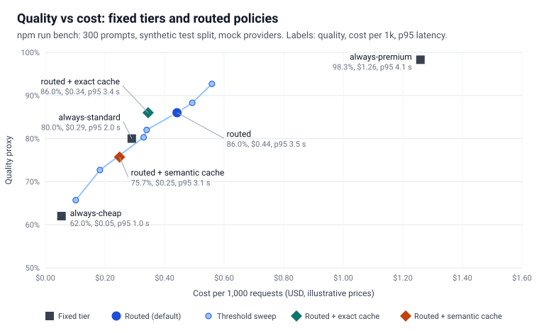
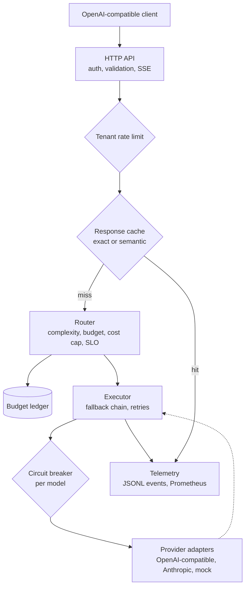

# llm-gateway

[](https://github.com/seanmcrae/llm-gateway-cost-aware-LLM-router-/actions/workflows/ci.yml)
[](https://seanmcrae.github.io/llm-gateway-cost-aware-LLM-router-/)
[](LICENSE)
[](package.json)

Does this request need your premium model? `llm-gateway` makes that call per request: it routes
each prompt to the cheapest model tier likely to answer it well, within the tenant's budget and
latency SLO, and keeps serving when a provider fails. Its replay benchmark shows what the routing
policy costs in quality before you turn it on.

**Live docs:** <https://seanmcrae.github.io/llm-gateway-cost-aware-LLM-router-/> has the benchmark
results, architecture and product brief on one page.

Most LLM traffic is classification, extraction and short answers that a small model handles, but
applications usually send everything to one premium model because choosing per request is extra
work. `llm-gateway` sits between your application and the providers and speaks the Chat
Completions API, so existing OpenAI clients only change their base URL. It scores each request's
complexity, picks a tier within the tenant's budget, cost cap and latency SLO, walks a fallback
chain with retries and circuit breakers when an upstream fails, caches deterministic answers, and
emits one cost and latency record per request. It ships with OpenAI-compatible and Anthropic
adapters and a deterministic mock provider, so the demo, tests, benchmark and CI run without API
keys.

## Numbers

The shipped default (`config/default.json`: routed, thresholds 0.25/0.5, exact cache) against
sending everything to the premium tier. Replay of the **300-prompt held-out test split** of the
synthetic prompt set through the real HTTP app with simulated providers; thresholds were tuned on a
separate 300-prompt dev split. From `bench/results.json`, which CI regenerates and diffs on every
push.

| Measure                              | Default: routed + exact cache | Baseline: always-premium |
| ------------------------------------ | ----------------------------: | -----------------------: |
| Quality proxy (simulated, see below) |                         86.0% |                    98.3% |
| Cost per 1k requests                 |                         $0.34 |                    $1.26 |
| p50 / p95 latency (service time)     |                434 / 3,351 ms |         1,910 / 4,099 ms |
| Cache hits, of which wrong           |                        84 / 0 |                        - |

That is 73% cheaper for 12.3 points of quality proxy, and most of those points come from one
prompt family the router cannot see ([Where it fails](#where-it-fails)). Without the cache the
routed policy costs $0.44 per 1k at the same quality. Prices and capabilities are illustrative, so
read the relative positions, not the absolute numbers.



## Quickstart

Requires Node 20 or later. No API keys.

```sh
npm ci && npm run build && npm start
```

The gateway listens on `http://127.0.0.1:8787/v1` with the bundled all-mock config
(`config/default.json`). From another shell:

```sh
curl -s http://127.0.0.1:8787/v1/chat/completions \
  -H 'authorization: Bearer sk-local-acme-demo' -H 'content-type: application/json' \
  -d '{"model":"auto","temperature":0,"messages":[{"role":"user","content":"Translate to French: good morning"}]}' -i
```

Any OpenAI SDK works the same way:

```ts
import OpenAI from "openai";
const client = new OpenAI({ baseURL: "http://127.0.0.1:8787/v1", apiKey: "sk-local-acme-demo" });
await client.chat.completions.create({
  model: "auto",
  messages: [{ role: "user", content: "Hi" }],
});
```

Other entry points: `npm run demo` (scripted walkthrough below), `npm run bench` (replay
benchmark), `npm run site` (docs site into `site/`), and
`docker build -t llm-gateway . && docker run --rm -p 8787:8787 llm-gateway`. To use real
providers, set `OPENAI_API_KEY` and `ANTHROPIC_API_KEY` and run
`node dist/bin/server.js --config config/providers.example.json`.

## Features

- **OpenAI-compatible API.** `POST /v1/chat/completions` (including `stream: true`, delivered as
  buffered SSE chunks), `GET /v1/models`, `GET /v1/usage`, `GET /metrics`, `GET /healthz`.
  Unsupported fields such as `tools` and `n > 1` are rejected with a 400 rather than ignored.
- **Policy routing.** `model: "auto"` scores complexity from the prompt (reasoning and design
  cues, code, constraint and question counts, quantities, length, simple-task cues) and maps the
  score to a tier. `model: "cheap" | "standard" | "premium"` fixes a tier; a configured model id
  pins one model. Every response says what was chosen and why in `x-llm-gateway-route`.
- **Budgets and constraints.** Per-tenant monthly budgets with reservations, so concurrent
  requests cannot jointly overspend; the top tier is switched off past 80% of budget. Per-request
  cost caps (`x-llm-gateway-max-cost-usd`) remove models; latency SLOs
  (`x-llm-gateway-latency-slo-ms` or per tenant) reorder them using measured p95.
- **Resilience.** Fallback chain (rest of the tier, then more capable tiers, then cheaper ones),
  retries with full-jitter exponential backoff that respects `Retry-After`, per-attempt timeouts,
  and a per-model circuit breaker (consecutive failures or failure rate, half-open probe).
- **Caching.** Exact-match cache keyed on tenant, model, sampling parameters and conversation;
  optional semantic layer matching the final user message by embedding similarity. Only
  temperature-0 requests are cached unless the client opts in with `x-llm-gateway-cache: on`.
- **Rate limits.** Per-tenant requests-per-minute and tokens-per-minute token buckets, corrected
  with real usage after each call; 429 responses carry `Retry-After`.
- **Telemetry.** One structured event per request (policy, complexity, route reason, model,
  attempts, retries, fallbacks, tokens, cost, cost at premium prices, latency, status) to a JSONL
  file, plus Prometheus counters and a latency histogram on `/metrics`.
- **Providers.** OpenAI-compatible adapter (OpenAI, Azure OpenAI, vLLM, Ollama or anything else that
  speaks the API, via `baseUrl`), Anthropic Messages adapter, and a deterministic mock with
  configurable latency, slow tail and failure rate. Adapters are tested against fake `fetch`
  only.

## Example output

Real output of `npm run demo`, which sends requests through the HTTP app in-process with a virtual
clock, so simulated latencies cost no wall time and every run prints the same thing:

```text
Routing by complexity (tenant acme, model=auto)

> Easy: sentiment classification
  200 mock-small (cheap)  cost $0.000021  latency 319 ms  attempts 1  cache miss
  route: complexity 0.00 -> cheap (simple:classify,sentiment)

> Medium: small coding task
  200 mock-medium (standard)  cost $0.000155  latency 935 ms  attempts 1  cache miss
  route: complexity 0.40 -> standard (code)

> Hard: multi-constraint design question
  200 mock-large (premium)  cost $0.002067  latency 2834 ms  attempts 1  cache miss
  route: complexity 0.67 -> premium (reasoning:design,migration,analyze; constraints:4; questions:2)

> Same easy request again (temperature 0)
  200 mock-small (cheap)  cost $0.000000  latency 0 ms  attempts 0  cache exact
  route: exact cache hit (similarity 1.000)

Per-request controls

> Hard question with x-llm-gateway-max-cost-usd: 0.004
  200 mock-medium (standard)  cost $0.000458  latency 1853 ms  attempts 1  cache bypass
  route: complexity 0.67 -> premium (reasoning:design,migration,analyze; constraints:4; questions:2); max cost $0.004 excluded mock-large

> Hard question for tenant globex (latency SLO 5000 ms)
  200 mock-medium (standard)  cost $0.000458  latency 1452 ms  attempts 1  cache miss
  route: complexity 0.67 -> premium (reasoning:design,migration,analyze; constraints:4; questions:2); latency SLO 5000 ms: mock-medium before mock-large

> Pinned model, bypassing the router
  200 mock-large-alt (premium)  cost $0.000510  latency 1035 ms  attempts 1  cache bypass
  route: pinned to mock-large-alt

Failure handling: mock-large forced to fail every call

> Hard question #1
  200 mock-large-alt (premium)  cost $0.002211  latency 5234 ms  attempts 4  cache miss
  route: complexity 0.67 -> premium (reasoning:design,migration,analyze; constraints:4; questions:2)

> Hard question #2
  200 mock-large-alt (premium)  cost $0.001476  latency 3946 ms  attempts 4  cache miss
  route: complexity 0.67 -> premium (reasoning:design,migration,analyze; constraints:4; questions:2)

> Hard question #3
  200 mock-large-alt (premium)  cost $0.001086  latency 1551 ms  attempts 2  cache miss
  route: complexity 0.67 -> premium (reasoning:design,migration,analyze; constraints:4; questions:2)

GET /v1/usage (acme)
  {"tenant":"acme","month":"2026-10","budgetUsd":50,"spentUsd":0.00321125,"reservedUsd":0,"remainingUsd":49.99678875,"spentFraction":0.000064}

GET /metrics (excerpt, failing gateway)
  llm_gateway_upstream_attempts_total{model="mock-large",outcome="error"} 5
  llm_gateway_upstream_attempts_total{model="mock-large-alt",outcome="ok"} 3
  llm_gateway_upstream_attempts_total{model="mock-large",outcome="breaker_open"} 2
  llm_gateway_breaker_state{model="mock-large"} 2
  llm_gateway_breaker_state{model="mock-large-alt"} 0
```

## Architecture



`Gateway.handle` in `src/gateway/gateway.ts` is the whole pipeline and is transport-agnostic: the
Hono app in `src/server/app.ts` and the replay benchmark both drive it. Time and randomness are
injected (`Clock`, `Sleeper`, `Random`), which is what makes breakers, buckets, budgets, backoff
and the benchmark deterministic under test.

## Results

`npm run bench` replays the 300-prompt **test** split of the synthetic prompt set through the HTTP
app once per policy. Thresholds were chosen on the separate dev split.

| Policy                  | Quality proxy | Cost / 1k req | p50 latency | p95 latency | Tier mix (cheap/std/premium) | Cache hits (false) |
| ----------------------- | ------------: | ------------: | ----------: | ----------: | ---------------------------- | -----------------: |
| always-cheap            |         62.0% |         $0.05 |      506 ms |     1044 ms | 100% / 0% / 0%               |                  - |
| always-standard         |         80.0% |         $0.29 |      955 ms |     2042 ms | 0% / 100% / 0%               |                  - |
| always-premium          |         98.3% |         $1.26 |     1910 ms |     4099 ms | 0% / 0% / 100%               |                  - |
| routed                  |         86.0% |         $0.44 |      684 ms |     3472 ms | 60% / 15% / 25%              |                  - |
| routed + exact cache    |         86.0% |         $0.34 |      434 ms |     3351 ms | 59% / 16% / 26%              |             84 (0) |
| routed + semantic cache |         75.7% |         $0.25 |      315 ms |     3078 ms | 61% / 16% / 23%              |           129 (35) |

What the numbers say:

- **Routing pays off against premium, less so against a fixed mid tier.** The routed policy sends
  60% of requests to the cheap tier and 25% to premium. It is 65% cheaper than always-premium and
  6 points better than always-standard for $0.15 more per 1k requests. Moving the thresholds traces
  the frontier in the chart: 0.1/0.3 reaches 92.7% at $0.56 (`bench/results.json`, `sweep`).
- **The gap is mostly one blind spot.** On the 25 `tricky` prompts (short puzzles about time zones,
  primes or prices, with no reasoning keywords) the router scores 8% against premium's 100%, which
  accounts for about 7.7 of the 12.3-point gap. A keyword heuristic cannot see that "Is 999,983
  prime?" is hard; this is where a learned classifier or a cheap-model self-check would earn its
  cost.
- **Exact caching is free quality-wise; semantic caching is not.** About a third of the set repeats
  an earlier question. The exact cache served 84 requests with no wrong answers. The semantic cache
  (bag-of-words embedding, cosine 0.95) served 129 but 35 were answers to a different question:
  long templated prompts where one detail changed, such as the same SQL report for 2023 instead of
  2024, or a migration plan between a different pair of databases. It stays off by default.
- **Latency follows the tier mix.** Routed p50 is lower than always-standard because most traffic
  goes to the fast tier; p95 is set by the premium share.

## How evaluation works

The gateway only sees prompts. After each response, the harness reads which model answered and
scores the answer with a **quality proxy**: a model of simulated capability `c` answers a prompt of
labelled difficulty `d` acceptably with probability `sigmoid(2(c - d) + 1)`, with the random draw
fixed per prompt so a stronger model never fails a prompt a weaker one passes. A cache hit counts
only if the reused answer was acceptable and belonged to the same question. Cost is the sum of
per-request costs from provider-reported tokens and configured prices. Latency is gateway-measured
per request, including retries and backoff, on a virtual clock; requests are sequential, so it is
service time rather than latency under load. Details in [bench/README.md](bench/README.md).

The proxy measures routing decisions under a stated capability model. It says nothing about any
real model's quality, and the absolute numbers depend on the illustrative capabilities and prices
in `config/default.json`. The useful outputs are the relative positions of the policies and the
per-category breakdown (`qualityByCategory` in `bench/results.json`).

## Data

`bench/prompts.synthetic.jsonl` is **synthetic**: 600 prompts (300 dev, 300 test) generated from
hand-written templates by `bench/generate.ts` with a fixed seed, recreated byte for byte by
`npm run bench:generate`. It contains no scraped, licensed or user data and is covered by this
repository's MIT license. The prices and latency profiles in `config/default.json` are illustrative
shapes of small, mid and large model tiers, not quotes for any vendor.

## Configuration

A config is one JSON file validated with zod at startup (`src/config/schema.ts`); errors list every
problem with its path.

| Section      | What it controls                                                                                                                                                                  |
| ------------ | --------------------------------------------------------------------------------------------------------------------------------------------------------------------------------- |
| `models[]`   | `id`, `provider` (`mock`, `openai`, `anthropic`), `upstreamModel`, `tier`, per-million-token `pricing`, `contextWindow`, `latencyPriorMs`, `baseUrl`, `apiKeyEnv`, `mock` profile |
| `routing`    | Ordered `tiers`, complexity `thresholds`, `defaultPolicy`, `budgetDowngradeAt`, `maxModelsPerRequest`, `latencyMinSamples`                                                        |
| `resilience` | `timeoutMs`, `maxRetries`, `backoff` (`baseMs`, `maxMs`), `breaker` thresholds and cooldown                                                                                       |
| `cache`      | `mode` (`off`, `exact`, `semantic`), `ttlMs`, `maxEntries`, `similarityThreshold`                                                                                                 |
| `tenants[]`  | `id`, `apiKeys`, `monthlyBudgetUsd`, `requestsPerMinute`, `tokensPerMinute`, optional `latencySloMs` and `policy`                                                                 |
| `telemetry`  | `jsonlPath` for the event log (or `--log` on the CLI)                                                                                                                             |

Per-request headers: `x-llm-gateway-max-cost-usd`, `x-llm-gateway-latency-slo-ms`,
`x-llm-gateway-cache: on|off`. Response headers: `x-request-id`, `x-llm-gateway-model`, `-tier`,
`-policy`, `-cache`, `-cost-usd`, `-latency-ms`, `-attempts`, `-route`. API keys for real
providers are read from the environment only (`.env.example`).

## Project layout

```text
src/
  api/schema.ts          OpenAI request/response schema and normalisation
  routing/               complexity scoring, router, pricing, latency tracking
  resilience/            backoff and circuit breaker
  cache/                 exact and semantic response cache, hashing embedder
  tenants/               rate limiter and budget ledger
  gateway/gateway.ts     the request pipeline
  providers/             mock, OpenAI-compatible and Anthropic adapters, factory
  telemetry/             request events, JSONL sink, Prometheus metrics
  server/app.ts          Hono HTTP API
  bin/server.ts          CLI entry point
config/                  default all-mock config and a real-provider example
bench/                   synthetic prompt set, generator, replay harness, results.json
scripts/                 demo and the static docs site generator
test/                    vitest suites (no network, no keys)
```

## Design decisions

- **Heuristic scoring, not a model call, on the hot path.** Scoring runs on every request, so it is
  a handful of regexes and counts with every contributing signal reported back to the client. A
  learned router is the obvious next step, and the benchmark is built to evaluate one.
- **Asymmetric errors.** Routing a hard prompt cheap costs quality; routing an easy one premium only
  costs money. Weights lean towards over-routing, and the fallback chain goes up a tier before it
  goes down.
- **Hard constraints filter, soft ones reorder.** Context window, cost cap and remaining budget
  remove candidates; the latency SLO only reorders them, because a slow answer is better than none.
- **Reserve, then settle.** A request reserves its worst-case cost across the fallback chain before
  calling upstream and settles to provider-reported usage afterwards, so concurrent requests cannot
  overspend a budget together. Rate-limit token estimates are corrected the same way.
- **One breaker per model, outcomes from the gateway's view.** Upstream 400s count as healthy (the
  request was bad, not the provider); auth failures skip to the next model without retries.
- **Cache only what is meant to be deterministic.** Temperature-0 requests by default, never across
  tenants, and the semantic layer requires the earlier conversation to match exactly.
- **Buffered streaming.** `stream: true` returns a correctly framed SSE stream after the full
  completion exists, so retries and fallbacks stay invisible. It keeps clients working but does not
  improve time to first token.
- **Everything time-dependent is injected.** That is what lets the benchmark replay about 3,900 requests
  through the real HTTP stack in about two seconds and get identical results on every machine.

## Limitations

- State (budgets, rate limits, breakers, cache, latency windows) is in memory and per process. A
  multi-instance deployment needs a shared store such as Redis; the telemetry log is the only
  durable record.
- The quality numbers are a simulation over synthetic prompts. Real traffic, real models and a real
  grader will give different absolute numbers and probably a smaller routing win.
- The complexity heuristic is English-centric and misses hard prompts that look simple.
- Streaming is buffered; tool calls, `n > 1`, images and embeddings endpoints are not supported.
- The semantic cache's embedder is a hashing bag of words. A real embedding model would cut false
  hits but not remove the risk, which is why exact caching is the default.
- Tenant API keys live in the config file. They are compared by hash and never logged, but a
  production deployment would load them from a secret store.
- The Docker image is provided but CI does not build it.

## Roadmap

See [docs/PRODUCT.md](docs/PRODUCT.md) for the problem, users, metrics, trade-offs and the
now / next / later roadmap.

## Contributing

See [CONTRIBUTING.md](CONTRIBUTING.md). Security issues: [SECURITY.md](SECURITY.md).

## License

MIT, copyright 2026 Sean McRae. See [LICENSE](LICENSE).
